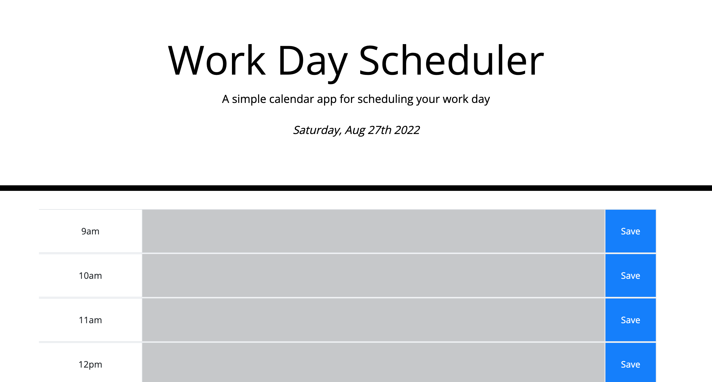
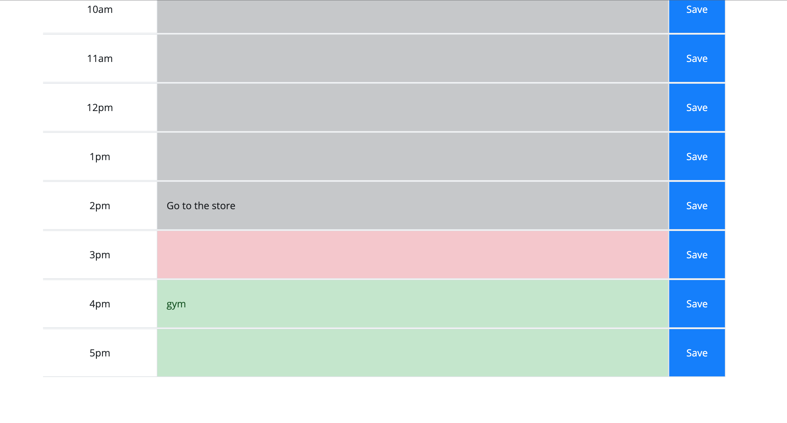

# Work Day Planner

The purpose of this application is to provide a clean and simple interface which allows the user to input and save tasks by the hour for a 9am to 5pm workday. The current date is displayed at the top of the screen.

With the time audit feature, the color of the time slots will change though out the work day, displaying past time slots as grey, the current time slot as red, and future time slots as green. When the user clicks a save button, any text, or lack there of, will be saved to local storage and loaded back to the window at a refresh so that tasks stay persistent.

## Application Photos

## Built With

- HTML
- CSS
- JavaScript
- Moment.js
- Bootstrap
- JQuery

### Website

https://tguy5837.github.io/work-day-planner/

### GitHub Repository

https://github.com/tguy5837/work-day-planner

## Contribution

Created by Taylor Guy
